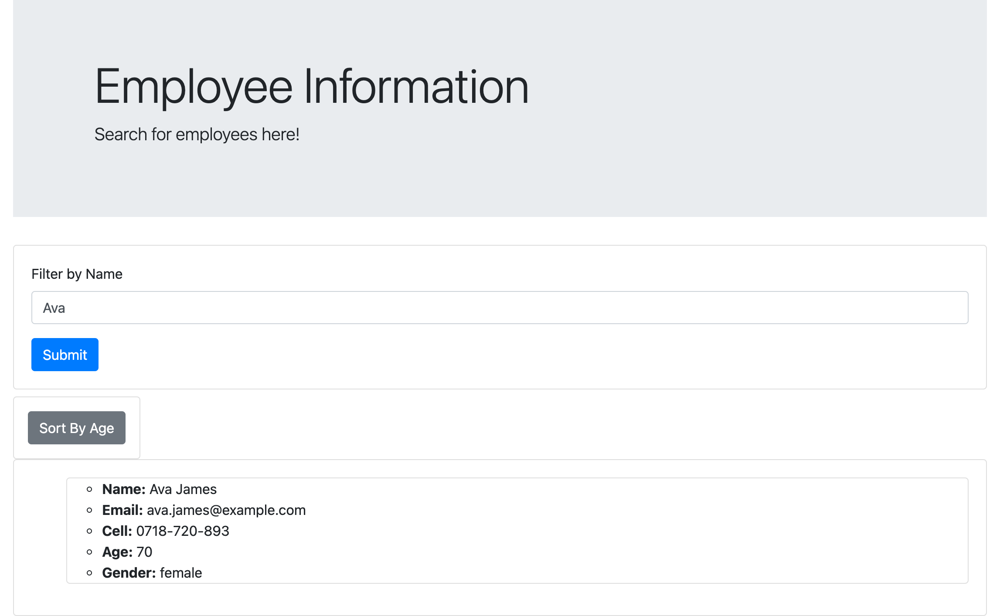
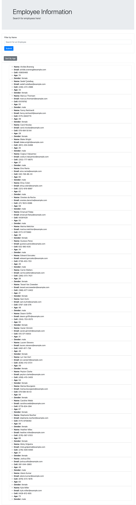

# Employee-Tracker

## Table of Contents

* [Description](#Description)
* [Technologies Used](#TechnologiesUsed)
* [Images](#Images)
* [Links](#Links)

# Description

This application was made using React.JS and Bootstrap. Users are able to view a directory of all employees in the system. Only non sensitive data is rendered on the page for each employee. There is a filter by name section as well as a sort by age button. 

# Images

# Links

Link to deployed application https://employtrack.herokuapp.com/

Link to Git Hub Repository https://github.com/vdecyatnik/employee-tracker